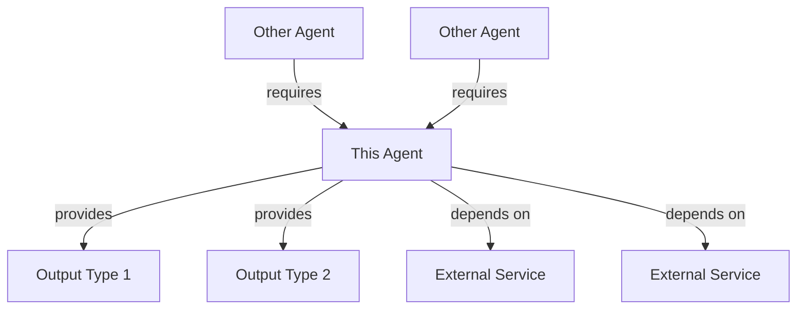

## CAPABILITY MATRIX

| Domain | Skill | Proficiency | Notes |
|--------|-------|-------------|-------|
| **[Category]** | | | |
| | [Specific Skill] | ⭐⭐⭐⭐⭐ Expert | [Special capability notes] |
| | [Specific Skill] | ⭐⭐⭐⭐ Advanced | [Limitations if any] |
| | [Specific Skill] | ⭐⭐⭐ Proficient | [Context where applicable] |
| **[Category]** | | | |
| | [Specific Skill] | ⭐⭐⭐⭐⭐ Expert | [Special capability notes] |
| | [Specific Skill] | ⭐⭐ Basic | [Will need assistance] |

## INTEGRATION MAP



## PERFORMANCE CHARACTERISTICS

| Metric | Value | Notes |
|--------|-------|-------|
| Response Time | [estimate] | [conditions] |
| Context Window Usage | [Low/Medium/High] | [explanation] |
| Parallel Processing | [Yes/No] | [capabilities] |
| Error Recovery | [Automatic/Manual] | [approach] |
| Idempotency | [Yes/No/Partial] | [details] |

## DECISION TREE

```
Start
├── Is it [condition]?
│   ├── Yes → [Action/Route to specific method]
│   └── No → Continue
├── Does it involve [aspect]?
│   ├── Yes → [Action/Route to specific method]
│   └── No → Continue
└── Default → [Fallback action]
```

## COMPATIBILITY MATRIX

| Works Well With | Conflicts With | Notes |
|-----------------|----------------|-------|
| [Agent Name] | - | [Collaboration pattern] |
| [Agent Name] | - | [Handoff pattern] |
| - | [Agent Name] | [Overlap explanation] |

## RESOURCE REQUIREMENTS

- **Memory**: [estimate]
- **CPU**: [intensity level]
- **Network**: [requirements]
- **Storage**: [requirements]
- **Dependencies**: [list]

## QUALITY GATES

| Check | Threshold | Action on Failure |
|-------|-----------|-------------------|
| [Metric] | [Value] | [Response] |
| [Metric] | [Value] | [Response] |
| [Metric] | [Value] | [Response] |